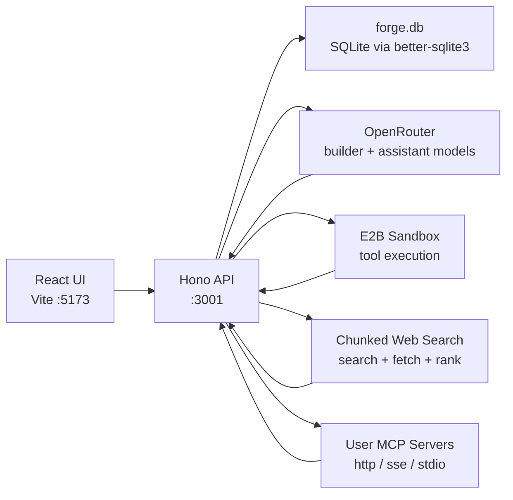
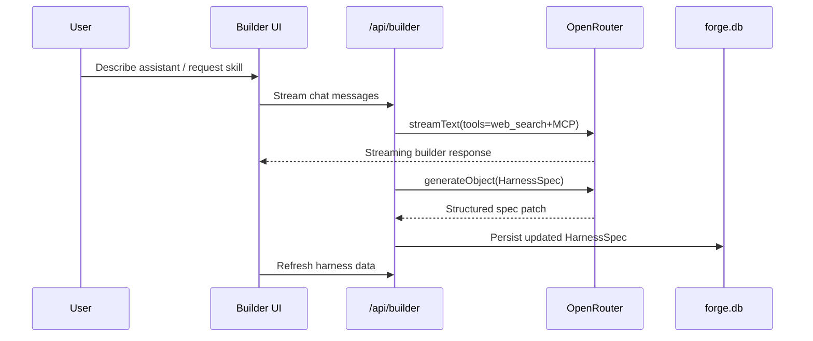
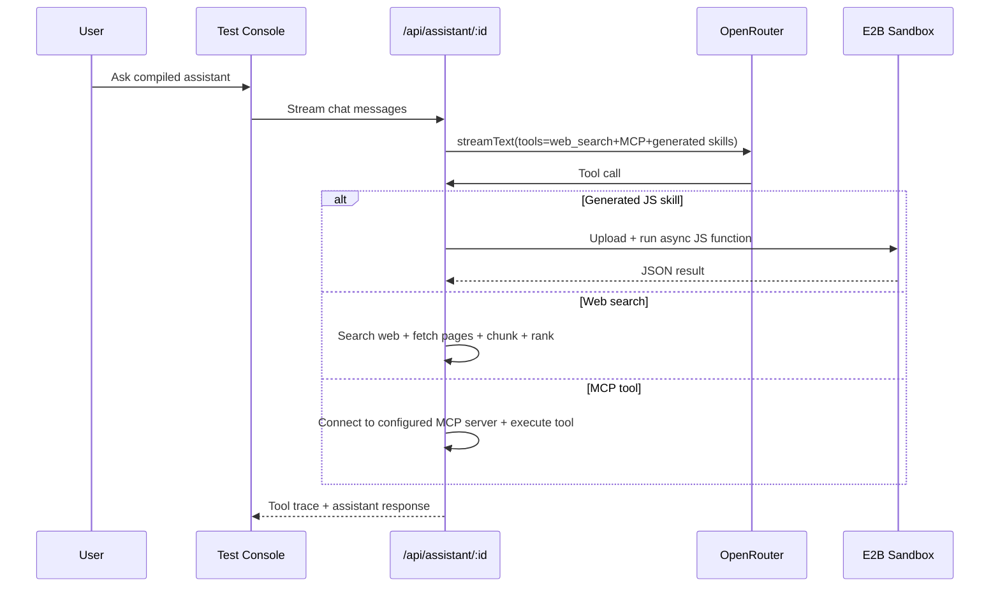

# YunForge


YunForge is a local-first, chat-first AI assistant builder. You describe the assistant you want in the builder pane, YunForge turns that conversation into a stored `HarnessSpec`, generates custom tool code as portable skills, and lets you test the compiled assistant immediately in a live console.

No auth. No cloud database. No deployment layer. Everything runs on your machine.

## What It Does

- Opens straight into a fixed-height three-panel workspace.
- Stores API keys and harness state in a local `forge.db`.
- Streams a builder chat through OpenRouter with the Vercel AI SDK.
- Normalizes every builder turn into a persisted `HarnessSpec`.
- Generates self-contained async JavaScript skills for tool use.
- Adds built-in chunked web search to both the builder chat and compiled agents.
- Loads user-supplied MCP servers into both the builder chat and compiled agents.
- Runs generated tools inside E2B sandboxes.
- Exports, imports, and shares assistants as portable `.forge.json` files.

## Interface

The app is intentionally dense, dark, and operational.

- Left sidebar: harness list, import/new actions, inline skill management, settings access.
- Center panel: builder chat plus a live `HarnessSpec` summary card.
- Right panel: compile/test console with inline tool traces.

## Architecture



### Builder Flow



### Assistant Runtime Flow



## Stack

- Frontend: Vite + React + TypeScript + Tailwind CSS
- UI primitives: stock shadcn/ui components
- Backend: Hono on Node
- AI SDK: Vercel AI SDK (`useChat`, `streamText`, `generateObject`)
- Model provider: OpenRouter
- Runtime integrations: built-in web search + user-supplied MCP servers
- Tool execution: E2B JavaScript sandbox
- Persistence: SQLite via `better-sqlite3`

## Local Persistence

`forge.db` is created automatically in the project root.

### Tables

```sql
settings(key TEXT PRIMARY KEY, value TEXT)
harnesses(id, name, spec JSON, status, created_at, updated_at)
```

### Stored settings

- `openrouter_key`
- `e2b_key`
- `default_model`
- `mcp_servers_json`

## Harness Model

### `HarnessSpec`

```ts
{
  goal: string
  audience: string
  model: string
  systemPrompt: string
  memoryPolicy: string
  tools: SkillSpec[]
}
```

### `SkillSpec`

```ts
{
  name: string
  description: string
  code: string            // self-contained async JS function
  inputSchema: JsonSchema
  outputSchema: JsonSchema
}
```

## Portable Export Format

Every harness can be exported or shared as a single `.forge.json` file:

```json
{
  "forgeVersion": "1.0",
  "name": "string",
  "exportedAt": "ISO timestamp",
  "spec": {
    "goal": "string",
    "audience": "string",
    "model": "string",
    "systemPrompt": "string",
    "memoryPolicy": "string"
  },
  "tools": []
}
```

## Runtime Tools

Both the builder chat and compiled assistants receive the same live runtime capabilities:

- `web_search`: searches the public web, fetches top pages, chunks readable content, ranks the chunks against the query, and returns excerpts with source URLs.
- MCP tools: loaded from the settings sheet on every request.
- Generated harness skills: added for compiled assistants and executed in E2B.

The search tool filters out search-engine redirect and ad clickthrough URLs before source pages are fetched, so the model gets organic pages and chunked excerpts instead of sponsored redirects.

### MCP JSON format

Paste a JSON array into Settings:

```json
[
  {
    "name": "filesystem",
    "transport": {
      "type": "stdio",
      "command": "npx",
      "args": ["-y", "@modelcontextprotocol/server-filesystem", "."]
    }
  },
  {
    "name": "docs",
    "transport": {
      "type": "http",
      "url": "https://example.com/mcp",
      "headers": {
        "Authorization": "Bearer ..."
      }
    }
  }
]
```

Supported transports:

- `http`
- `sse`
- `stdio`

If the JSON is invalid or a configured MCP server is unavailable, YunForge skips that server for the current request and injects the warning into the runtime prompt instead of failing the whole chat.

## API Surface

### Core routes

- `GET /api/settings`
- `PATCH /api/settings`
- `GET /api/harness`
- `GET /api/harness/:id`
- `POST /api/harness`
- `PATCH /api/harness/:id`
- `DELETE /api/harness/:id`
- `GET /api/harness/:id/export`
- `POST /api/builder`
- `POST /api/assistant/:harnessId`

## Run Locally

### Requirements

- Node.js 20+
- pnpm 10+

### Install

```bash
pnpm install
```

With pnpm v10+, build scripts are ignored by default. To compile native modules like `better-sqlite3`, you must approve the build scripts and rebuild:

```bash
pnpm approve-builds
pnpm rebuild
```

### Start

```bash
pnpm dev
```

This launches:

- Vite on `http://localhost:5173`
- Hono on `http://localhost:3001`

### Production build

```bash
pnpm build
pnpm lint
```

## Settings Workflow

Open the Settings sheet and provide:

- OpenRouter API key
- E2B API key, when your harness uses generated JavaScript skills
- Default model string, for example `deepseek/deepseek-chat`
- Optional MCP servers JSON

All values save to SQLite on blur.

## Typical Workflow

1. Click `New Harness`.
2. Describe the assistant in the builder chat.
3. Let YunForge generate or refine the `HarnessSpec`.
4. Edit or delete generated skills inline if needed.
5. Click `Compile & Test`.
6. Chat against the compiled assistant in the right panel.
7. Export or copy a share link when the harness is ready.

## Project Structure

```text
src/
  components/
  context/
  lib/
server/
  ai.ts
  db.ts
  e2b.ts
  index.ts
shared/
  schema.ts
forge.db
```

## Verification

Validated in this repo with:

- `pnpm build`
- `pnpm lint`
- Direct runtime smoke test of `searchWebWithChunks(...)` returning fetched sources and ranked chunks
- Direct runtime smoke test of invalid `mcp_servers_json` degrading to warnings while preserving built-in tools
- Browser smoke test against the running app on `http://localhost:5173`
- API smoke checks on `http://localhost:3001/api/health` and `GET /api/harness`

## Notes

- The app is intentionally local-only.
- API keys are stored unencrypted in `forge.db` because there is no auth layer and no remote backend.
- MCP server credentials inside `mcp_servers_json` are also stored in `forge.db`.
- Generated skills execute in E2B, not in the browser or local Node process.
- Built-in web search uses live public pages, chunks fetched content, and returns ranked excerpts to the model.
- Builder edits mark the harness `draft`; `Compile & Test` promotes it back to `compiled`.
